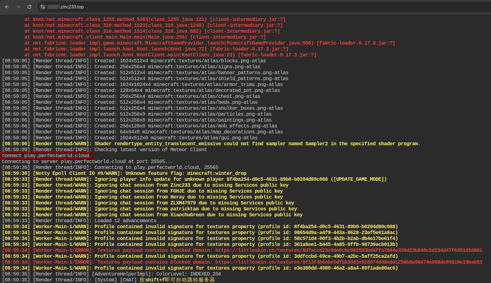

最近在玩 MC 服务器，造完了生电机器，但长期使用自己电脑挂机挺麻烦的，而且服务器不允许使用假人。正好手上有台2核2G的服务器，于是就想在自己的服务器上挂机。

找到了一个项目，发现刚好符合需求，便尝试了一下。

import { GithubCard } from 'astro-pure/advanced'

<GithubCard repo='3arthqu4ke/headlessmc' />

[HeadlessMC 文档](https://3arthqu4ke.github.io/headlessmc/launch/) 写的还算详细，按照他的流程很快就能进入游戏挂机，但是如果要执行一些简单的操作，似乎就有点复杂了。

## 最基础的 HeadlessMC 运行
在 clone 项目后，通过 `java -jar headlessmc-launcher.jar`运行，大致步骤如下：

``` bash
login  # 登陆MC，会给一个微软的登陆链接
launch fabric:1.21.5  # 下载MC
specifics 1 hmc-specifics  # 安装 hmc-specifics
launch fabric:1.21.5  # 重新启动该版本
connect xxx.com  # 连接到服务器
```

安装了 [HMC Specifics](https://3arthqu4ke.github.io/headlessmc/specifics/) 后，游戏内就可以使用一些简单的命令，做出一些简单的操作了

但是，在此基础上，我想能够自动点击，方便猪人塔等的AFK挂机，光是这样配置就有些不够了。幸运的是，[HMC Plugins](https://3arthqu4ke.github.io/headlessmc/plugins/) 提供了 `彗星端(Meteor)`的插件，可以利用彗星端的功能实现自动点击。

## 配置彗星端 Meteor

按照文档，将 [HMC Meteor](https://github.com/3arthqu4ke/hmc-meteor) 放在 `HeadlessMC/plugins` 并不生效。此时版本如下：

| 软件 | 版本 |
|-|-|
| HeadlessMC | 2.6.1 |
| HMC Meteor | 0.2.0 |

发现什么都没有发生，无法正常在HMC中使用`meteor`命令。

在尝试这个项目时，HMC 最后更新时间是 _5月前_ ，而 HMC Meteor 最后更新时间是 _1年前_ ，因此怀疑版本不匹配。

最后，使用了以下版本

| 软件 | 版本 |
|-|-|
| HeadlessMC | 2.0.0 |
| HMC Meteor | 0.2.0 |
| Minecraft | 1.21.1 |

但是，也只有在hmc中能使用`meteor`命令，当`launch`游戏后，依然无法使用`meteor`命令。但这问题不大，可以使用`msg`命令来发送`meteor`命令，如：

``` bash title="自动攻击挂机脚本"
msg .rotation set west  # 控制朝向
msg .settings auto-clicker delay-left 30  # 设置点击间隔
msg .settings auto-clicker mode-right Disabled  # 禁用鼠标右键
msg .toggle auto-clicker on  # 开启自动点击
```

注意：不能直接发送`.meteor-command`，在 HMC 中，`.`会被当作`msg` [](https://3arthqu4ke.github.io/headlessmc/specifics/#chat) ， 直接使用`.`会被当作聊天消息发送。

此外我在启动时会报错，具体解决方法在 [docker 中遇到的问题](#docker-中遇到的问题) 中

import { Collapse } from 'astro-pure/user'

<Collapse title='问题'>


``` txt 
[06:48:29] [main/INFO] [AssetsDownloader]: Downloading assets took 137402ms, parallel: true
[06:48:29] [main/INFO] [ProcessFactory]: Game will run in /root/.minecraft
[06:48:33] [main/INFO]: Loading Minecraft 1.21.1 with Fabric Loader 0.17.3
[06:48:33] [main/INFO]: Fabric is preparing JARs on first launch, this may take a few seconds...
[06:48:33] [main/INFO]: Loading 6 mods:
        - fabricloader 0.17.3
           \-- mixinextras 0.5.0
        - java 21
        - meteor-client 0.5.8
           \-- fabric-resource-loader-v0 1.3.0+565991296a
        - minecraft 1.21.1
[06:48:33] [main/INFO]: SpongePowered MIXIN Subsystem Version=0.8.7 Source=file:/root/.minecraft/libraries/net/fabricmc/sponge-mixin/0.16.5+mixin.0.8.7/sponge-mixin-0.16.5+mixin.0.8.7.jar Service=Knot/Fabric Env=CLIENT
[06:48:33] [main/INFO]: Compatibility level set to JAVA_17
[06:48:33] [main/INFO]: Compatibility level set to JAVA_21
[06:48:33] [main/WARN]: Error loading class: baritone/command/defaults/ComeCommand (java.lang.ClassNotFoundException: baritone/command/defaults/ComeCommand)
[06:48:33] [main/WARN]: @Mixin target baritone.command.defaults.ComeCommand was not found meteor-client-baritone.mixins.json:ComeCommandMixin from mod meteor-client
[06:48:34] [main/INFO]: Initializing MixinExtras via com.llamalad7.mixinextras.service.MixinExtrasServiceImpl(version=0.5.0).
[06:48:34] [Datafixer Bootstrap/INFO]: 226 Datafixer optimizations took 163 milliseconds
[06:48:37] [Render thread/INFO]: Environment: Environment[sessionHost=https://sessionserver.mojang.com, servicesHost=https://api.minecraftservices.com, name=PROD]
[06:48:37] [Render thread/INFO]: Setting user: xxx
[06:48:37] [Render thread/INFO]: Backend library: LWJGL version 3.3.3-snapshot
---- Minecraft Crash Report ----
// There are four lights!

Time: 2025-10-11 06:48:37
Description: Initializing game

java.lang.IllegalStateException: Failed to initialize GLFW, errors: GLFW error during init: [0x1000E]Failed to detect any supported platform  // [!code hl]
        at knot//com.mojang.blaze3d.platform.GLX._initGlfw(GLX.java:77)
        at knot//com.mojang.blaze3d.systems.RenderSystem.initBackendSystem(RenderSystem.java:509)
        at knot//net.minecraft.class_310.<init>(class_310.java:502)
        at knot//net.minecraft.client.main.Main.main(Main.java:239)
        at net.fabricmc.loader.impl.game.minecraft.MinecraftGameProvider.launch(MinecraftGameProvider.java:506)
        at net.fabricmc.loader.impl.launch.knot.Knot.launch(Knot.java:72)
        at net.fabricmc.loader.impl.launch.knot.KnotClient.main(KnotClient.java:23)


A detailed walkthrough of the error, its code path and all known details is as follows:
---------------------------------------------------------------------------------------

-- Head --
Thread: Render thread
Stacktrace:
        at knot//com.mojang.blaze3d.platform.GLX._initGlfw(GLX.java:77)
        at knot//com.mojang.blaze3d.systems.RenderSystem.initBackendSystem(RenderSystem.java:509)
        at knot//net.minecraft.class_310.<init>(class_310.java:502)

-- Initialization --
Details:
        Modules: 
Stacktrace:
        at knot//net.minecraft.client.main.Main.main(Main.java:239)
        at net.fabricmc.loader.impl.game.minecraft.MinecraftGameProvider.launch(MinecraftGameProvider.java:506)
        at net.fabricmc.loader.impl.launch.knot.Knot.launch(Knot.java:72)
        at net.fabricmc.loader.impl.launch.knot.KnotClient.main(KnotClient.java:23)
```

</Collapse>

## 配置 Baritone
在 [Baritone Release](https://github.com/cabaletta/baritone/releases) 下载对应MC版本的api版，放在MC的mods文件夹下，一般在默认的MC文件夹下，如： `/home/<User Name>/.minecraft/mods/`，如果使用Docker部署，一般在`/root/.minecraft/mods/`。

这样在游戏里就可以直接使用了，如

``` txt 
#goto x y z
```

注意：最好不要 `goto 方块`，我在测试时发现，运行该命令并不会执行，还有可能卡死HMC。

这样，就可以自动寻路了。

## Docker 中遇到的问题

由于在 Docker 中运行没有图形界面，因此我的解决方案是安装图形界面的相关软件包，从而模拟界面。

软件包如下：

``` bash
xvfb
libx11-6
libxext6
libxrandr2
libgl1
libglx-mesa0
libgl1-mesa-dri
libglu1-mesa
ca-certificates-java
```

并使用如下的脚本启动 `HMC`:

``` bash
Xvfb :99 -screen 0 800x600x24 &
XVFB_PID=$!

export DISPLAY=:99

export LIBGL_ALWAYS_SOFTWARE=true

echo "Waiting for Xvfb to be ready..."
sleep 5

echo "Starting Minecraft..."
java -Xmx2G -jar ./headlessmc-launcher-wrapper-2.0.0.jar
```

最后也是能成功进入服务器


## 服务器部署
我简单的编写了一个Dockerfile，利用 [ttyd](https://github.com/tsl0922/ttyd) ，开启一个Web终端，方便随时使用

代码在：

<GithubCard repo='Zinc23333/HMC-with-meteor-in-Docker' />

## 其他尝试

在此期间，还尝试了 [MCC](https://mccteam.github.io/) ，但目前似乎不支持 `1.21+`，因此放弃了。
