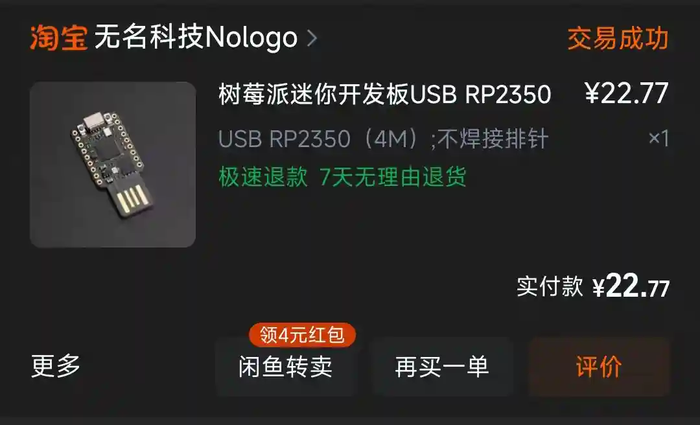
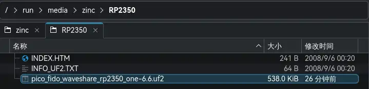
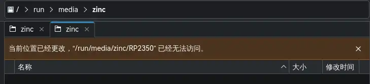
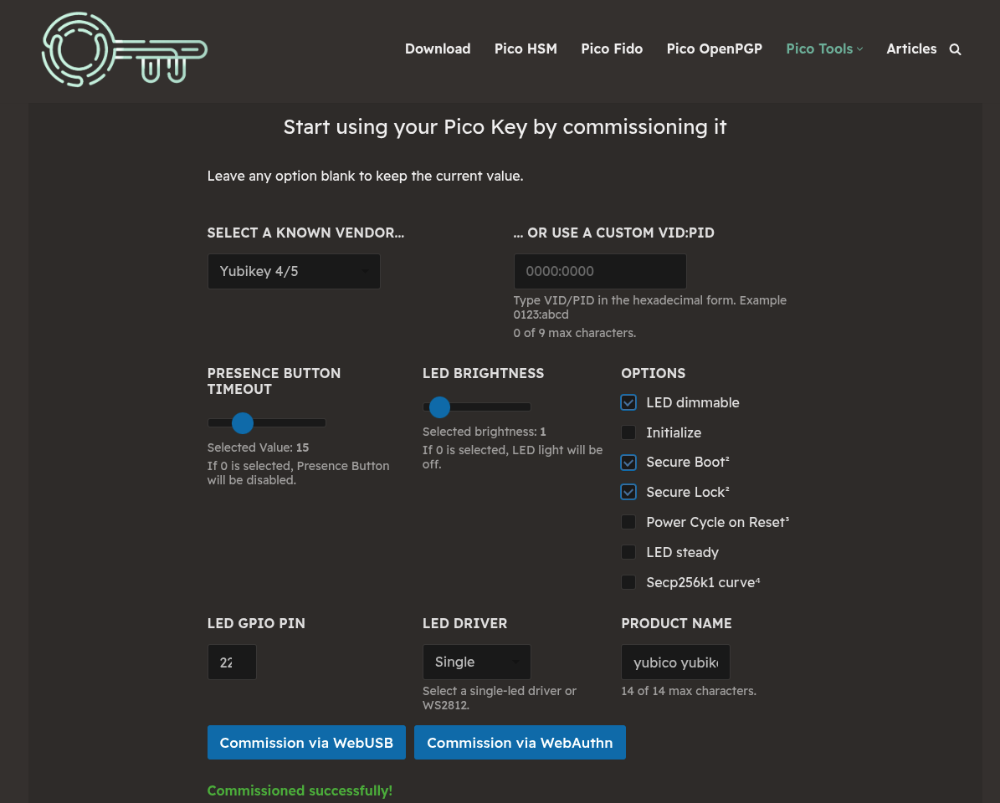
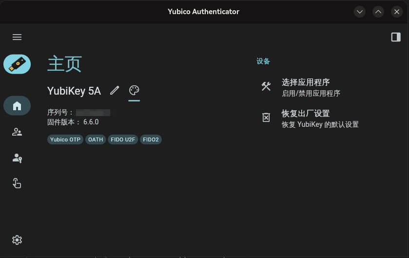
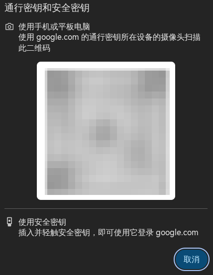
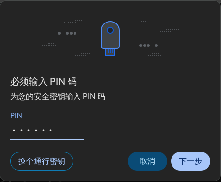
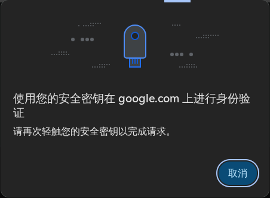

## 前言

最近看到 LYC8503 大佬的帖子 [30 元低成本自制开源版 Yubikey (支持 FIDO2 的硬件安全密钥)](https://blog.lyc8503.net/post/diy-fido-key/) 有点心动，因此也买了一个做了一下。因为这篇帖子写的已经非常详细了，因此这篇博客只简单记录一下过程。

## 材料

硬件用的是无名科技 Nologo 的 USB RP2350(4M) 

## 步骤

1. 下载固件：[Github Pico Fido Release](https://github.com/polhenarejos/pico-fido/releases)，我下载的是 [pico_fido_waveshare_rp2350_one-6.6.uf2](https://github.com/polhenarejos/pico-fido/releases/download/v6.6/pico_fido_waveshare_rp2350_one-6.6.uf2) 在使用过程中，功能都正常
2. 烧录固件：**按住** Boot 键将板子插入，此时电脑会多一个存储设备，将下载的固件直接拖入即可。

拷贝完成后，会自动重启，设备自动断开连接。

3. 打开[Pico Commissioner](https://www.picokeys.com/pico-commissioner/)，设置如下：

- Select a known vendor: `Yubikey 4/5`
- LED brightness: `1` (LED的亮度，建议设置为1，感觉还挺亮的)
- LED GPIO pin: `22` (LED的引脚，Nologo的RP2350的板载LED引脚是22)
- LED driver: `Single`
- Product Name: `yubico yubikey` (最好用这个)
- Options:
  - LED dimmable
  - Secure Boot 
  - Secure Lock (注意这个开启后只能刷入官方固件，建议正式使用的时候再开启，[解法](https://github.com/polhenarejos/pico-nuke))

所有步骤完成

这个在官方的 [Yubico Authenticator](https://www.yubico.com/products/yubico-authenticator/) 中也是能正常读取的

## 用法

在Google、微软等启用PassKey的流程大致如下：

1. 在登陆前先插入该设备

一般在这个界面之前（我在这个界面插入设备，偶尔会读不到）

2. 读到设备后输入PIN（第一次可能需要设置）

3. *单击*设备上的***Boot***键

完成登陆

## 外壳

如果需要外壳，可以参考这个项目: [Picokey Case RP2350/RP2040 DIY Yubikey Passkey](https://www.printables.com/model/1373168-picokey-case-rp2350rp2040-diy-yubikey-passkey/files)

## 参考
1. [32元制作一个超好玩的物理安全密钥Pico Keys](https://www.5yyx.com/?p=399)
2. [30 元低成本自制开源版 Yubikey (支持 FIDO2 的硬件安全密钥)](https://blog.lyc8503.net/post/diy-fido-key/)

(🤓👆诶，我只用了22元)