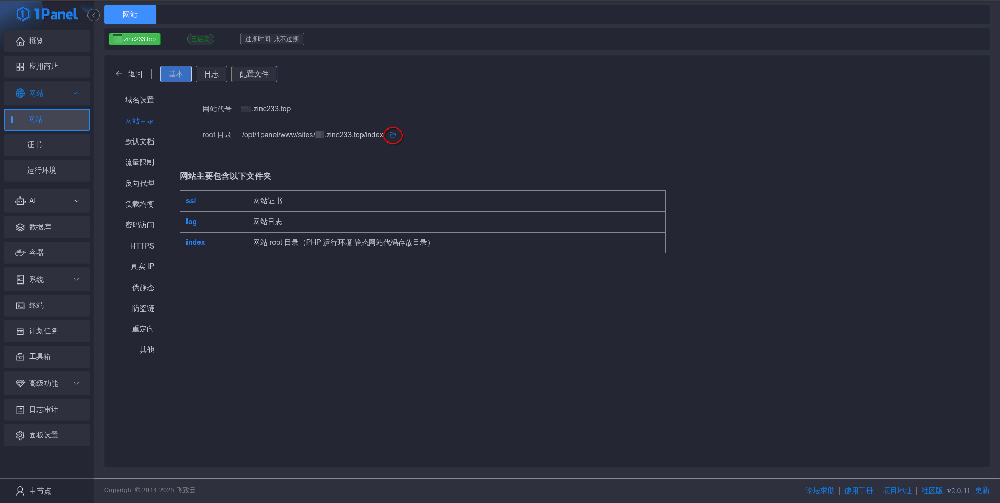
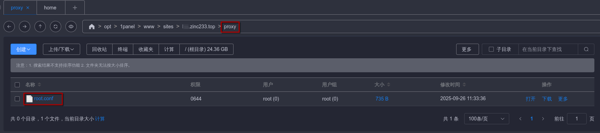
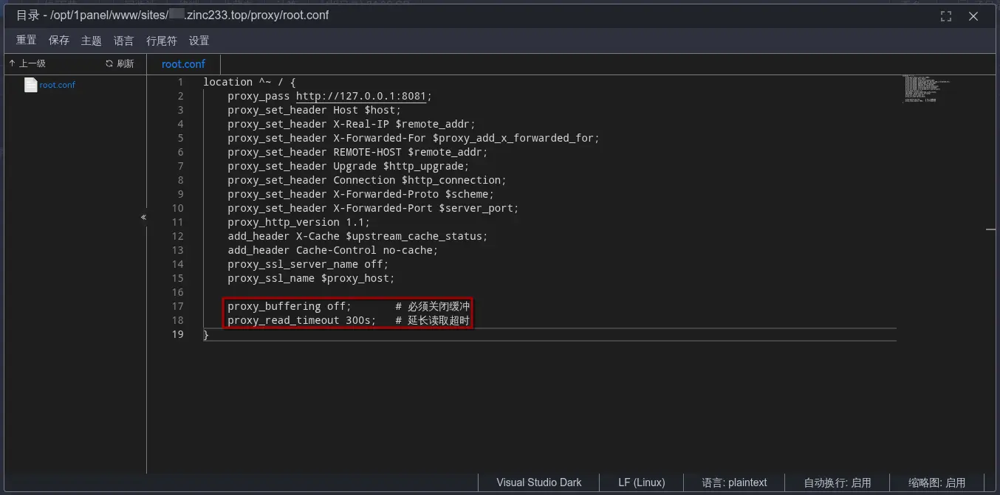

## 问题描述
在做课设写大语言模型流式输出的API时，发现本地测试、服务器使用`ip:port`访问均正常。但使用域名访问时，不会流式输出，而是到最后整段话一起输出。

简简单单的流式输出Python代码：
``` python
@app.post("/ask-stream-chat")
async def ask_stream_chat(req: StreamQueryRequest):
    session_id = req.session_id or str(uuid.uuid4())
    
    async def generate():
        async for chunk in chain.astream(
            {"question": req.question},
            config={"configurable": {"session_id": session_id}}
        ):
            yield chunk.content
    
    return StreamingResponse(
        generate(), 
        media_type="text/plain",
        headers={"X-Session-ID": session_id}
    )
```

在排查了SSL证书、Nginx配置后，确认了是Nginx配置的问题。


## 环境
我使用的是 1Panel 管理面板，OpenResty 管理的 Nginx。

通过用AI排查问题，最终确定是默认的Nginx配置有问题——默认存在缓冲。

## 解决方法

总而言之，在对应的Nginx配置中添加以下代码即可解决问题:

``` nginx
location ^~ / {
    proxy_buffering off;  
}
```

### 具体操作

1. 进入网站管理面板，并进入文件打开这个网站的配置文件夹 `/opt/1panel/www/sites/xxx/index`



2. 在此基础上导航至 `../proxy/root.conf`，即 `/opt/1panel/www/sites/xxx/proxy/root.conf`




3. 在这个配置文件追加几行配置



最终完整的配置如下：
``` nginx
location ^~ / {
    proxy_pass http://127.0.0.1:8081;
    proxy_set_header Host $host;
    proxy_set_header X-Real-IP $remote_addr;
    proxy_set_header X-Forwarded-For $proxy_add_x_forwarded_for;
    proxy_set_header REMOTE-HOST $remote_addr;
    proxy_set_header Upgrade $http_upgrade;
    proxy_set_header Connection $http_connection;
    proxy_set_header X-Forwarded-Proto $scheme;
    proxy_set_header X-Forwarded-Port $server_port;
    proxy_http_version 1.1;
    add_header X-Cache $upstream_cache_status;
    proxy_ssl_server_name off;
    proxy_ssl_name $proxy_host;
    add_header Alt-Svc 'h3=":443"; ma=2592000';
    add_header Cache-Control no-cache;
    add_header Strict-Transport-Security "max-age=31536000";
    
    // [\!code highlight:2]
    proxy_buffering off;       # 必须关闭缓冲
    proxy_read_timeout 300s;   # 延长读取超时
}
```